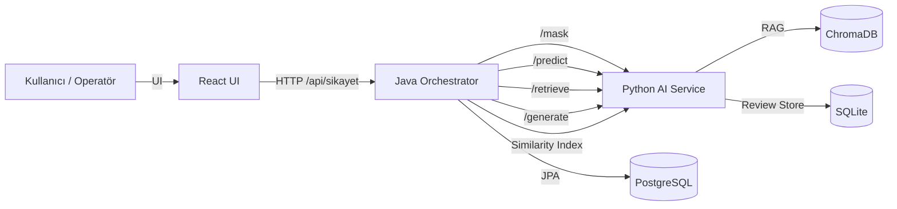
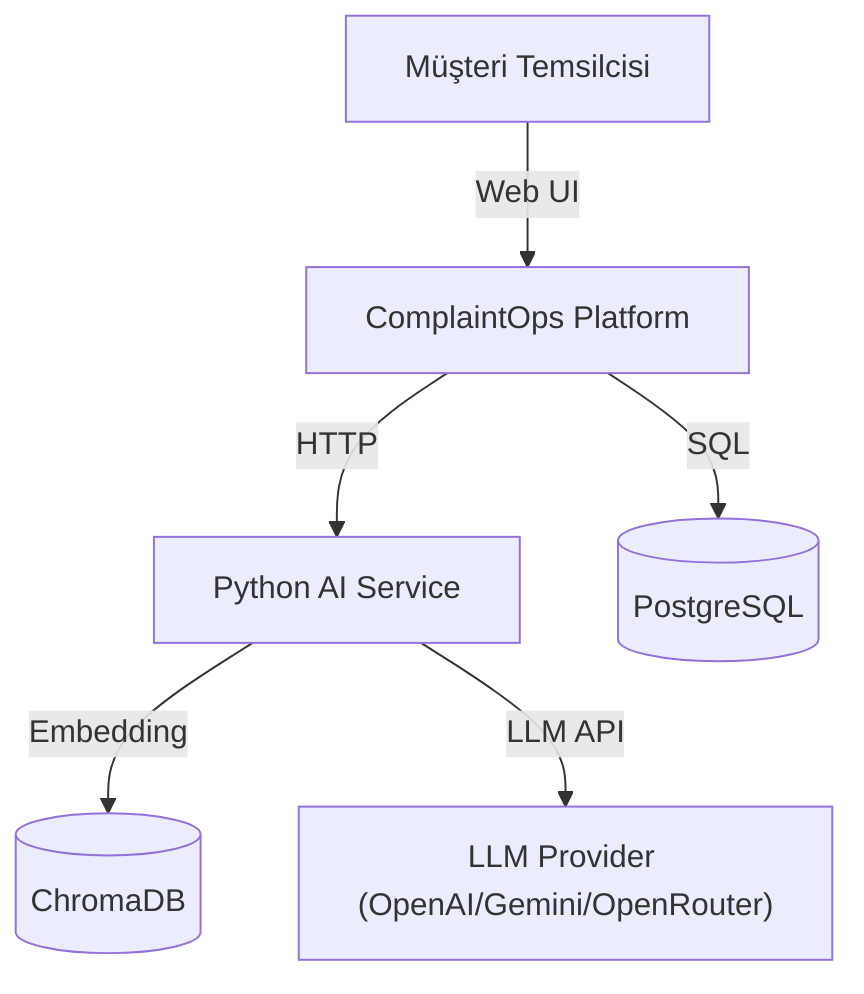
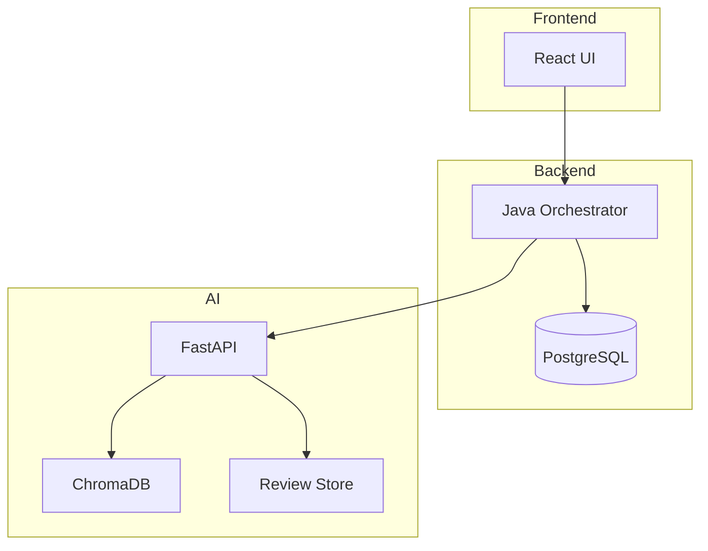
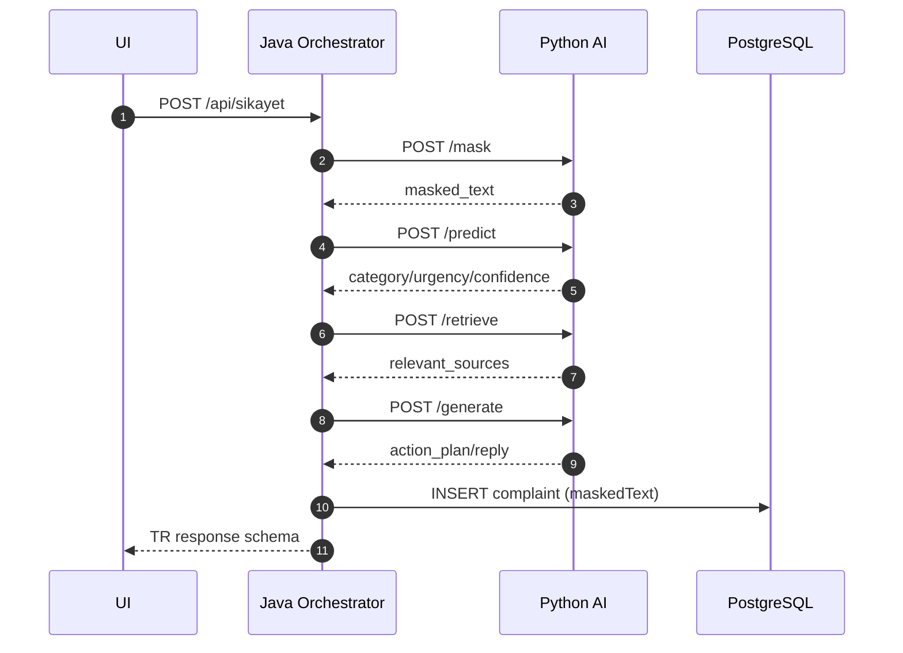

0) Kapak
- Proje Adı: ComplaintOps Copilot – Bankacılık Şikayet Yönetim Sistemi
- Alt Başlık: KVKK uyumlu AI destekli şikayet analiz, triage, RAG ve yanıt taslaklama platformu
- Sürüm: Repo ana sürüm (doküman tabanlı)
- Tarih: 2026-01-26 (repo kanıtlarında görülen en son rapor tarihi)
- Hazırlayan(lar): Teknik Denetim Raporu
- Repo/Çalıştırma Ortamı (kısa): Docker Compose ile PostgreSQL + Java Spring Boot + Python FastAPI + React; servis portları 5432/8080/8000/3000 olarak tanımlı. Kanıt/İz: docker-compose.yml.

Özet
ComplaintOps Copilot, bankacılık şikayetlerinin KVKK uyumlu biçimde maskeleme → triage → RAG → LLM yanıt taslağı üretim hattından geçirilmesini sağlayan çok katmanlı bir platformdur. Çekirdek yaklaşım, ham metnin hiçbir aşamada depolanmaması ve maskeleme başarısız olduğunda fail-closed davranışıyla işlem hattının durdurulmasıdır; bu yaklaşım hem Java orchestrator hem de Python AI servisinde uygulanmıştır. Kanıt/İz: backend-java/src/main/java/com/complaintops/backend/OrchestratorService.java (analyzeComplaint), backend-python/app/api/routes.py (mask/predict/retrieve/generate).

Sistemin Temel Özellikleri
- KVKK uyumlu “no raw text” yaklaşımı; şikayet entity’si ham metin alanı içermez ve sadece maskedText saklanır. Kanıt/İz: backend-java/src/main/java/com/complaintops/backend/Complaint.java.
- Fail-closed maskeleme: maskeleme hatasında iş akışı durur ve MASKING_FAILED kaydı üretilir. Kanıt/İz: backend-java/src/main/java/com/complaintops/backend/OrchestratorService.java.
- Çift aşamalı PII maskeleme: Presidio + regex failsafe yaklaşımı. Kanıt/İz: backend-python/app/services/masking_service.py (mask_with_double_pass).
- Triage modeli ile kategori + aciliyet çıkarımı ve güven skorları; düşük güven durumunda insan inceleme kayıtları açılır. Kanıt/İz: backend-python/app/api/routes.py (predict), backend-python/app/services/triage_service.py.
- RAG tabanlı SOP kaynak eşleştirme; ChromaDB tabanlı persistent indeksleme. Kanıt/İz: backend-python/app/services/rag_service.py.
- LLM sağlayıcı soyutlama katmanı: OpenAI/Gemini/OpenRouter arasında seçim. Kanıt/İz: backend-python/app/services/llm_service.py.
- İnsan-in-the-loop akışı: review store ve onay/reddetme endpoint’leri. Kanıt/İz: backend-python/app/services/review_service.py, backend-java/src/main/java/com/complaintops/backend/ComplaintController.java.
- Yanıt düzenleme için audit trail: complaint edit kayıtları. Kanıt/İz: backend-java/src/main/java/com/complaintops/backend/ComplaintEdit.java.
- Benzer şikayet araması: masked text üzerinden embedding tabanlı similarity. Kanıt/İz: backend-python/app/services/similarity_service.py, backend-java/src/main/java/com/complaintops/backend/ComplaintController.java.
- Log sanitization ve request_id ile izlenebilirlik. Kanıt/İz: backend-python/app/core/logging.py, backend-python/app/main.py.
- Uçtan uca UI akışı: şikayet girişi → analiz → öneri → onay/ret/hold. Kanıt/İz: frontend-react/App.tsx.
- Mevcut ölçümler: eval_results.json içinde kategori doğruluk ve gecikme metrikleri mevcut; aksi performans ölçümleri TBD. Kanıt/İz: docs/evidence/eval_results.json.

1. Amaç ve Kapsam
1.1 Amaç
Bu sistemin amacı, bankacılık şikayetlerinin KVKK uyumlu biçimde maskeleme ve sınıflandırmadan geçirilerek, standart operasyon prosedürleri (SOP) ile desteklenen profesyonel yanıt taslakları üretmektir. Ölçülebilir hedefler arasında fail-closed PII güvenliği, insan inceleme gerektiren düşük güven vakalarının ayrıştırılması ve kaynak izlenebilirliği vardır. Kanıt/İz: backend-java/src/main/java/com/complaintops/backend/OrchestratorService.java; backend-python/app/api/routes.py.

1.2 Kapsam
Sistem, maskedText temelli analiz ve yönlendirme sunar; ham metin depolamayı kapsam dışı bırakır. Kanıt/İz: backend-java/src/main/java/com/complaintops/backend/Complaint.java.
Sistemin kapsadığı akış: UI üzerinden şikayet girişi → Java orchestrator → Python AI servisleri → DB kayıtları → UI sonuç gösterimi. Kanıt/İz: frontend-react/App.tsx; backend-java/src/main/java/com/complaintops/backend/ComplaintController.java.
Kapsam dışı: kimlik doğrulama, rate limit, merkezi audit/WORM log ve production SLA yönetimi. Kanıt/İz: docs/audit/KVKK_SECURITY_MODEL.md.

2. Sistem Genel Bakış
2.1 Bileşenler
Frontend katmanı React tabanlı tek sayfa uygulamadır; şikayet metni girişi, pipeline durum kartları, benzer şikayet listesi ve yanıt taslak düzenleme akışını içerir. Kanıt/İz: frontend-react/App.tsx.
Java backend, API sözleşmelerini sağlar ve Python AI servislerine orkestrasyon yapar; maskeleme, triage, RAG ve LLM adımlarını sıralı şekilde çağırır. Kanıt/İz: backend-java/src/main/java/com/complaintops/backend/OrchestratorService.java.
Python AI service, FastAPI ile maskeleme, triage, RAG ve LLM üretimi gibi çekirdek AI adımlarını sunar. Kanıt/İz: backend-python/app/api/routes.py.
PostgreSQL, şikayet kayıtlarının maskedText ve analiz sonuçlarıyla birlikte tutulduğu ana veritabanıdır. Kanıt/İz: backend-java/src/main/resources/application.properties.
ChromaDB, SOP ve complaint embedding indeksleri için persistent vektör veri deposu sağlar. Kanıt/İz: backend-python/app/services/rag_service.py; backend-python/app/services/similarity_service.py.
SQLite tabanlı review store, insan-in-the-loop kararlarının audit edilebilmesi için review kayıtlarını saklar. Kanıt/İz: backend-python/app/services/review_service.py.

2.2 Uçtan Uca Akış Özeti
Kullanıcı UI üzerinden şikayet metni gönderir ve Java orchestrator /api/sikayet üzerinden süreci başlatır. Kanıt/İz: frontend-react/services/backendService.ts; backend-java/src/main/java/com/complaintops/backend/ComplaintController.java.
Orchestrator, önce /mask ile PII maskelemesi yapar; başarısızlıkta fail-closed davranışıyla MASKING_FAILED kaydı oluşturur. Kanıt/İz: backend-java/src/main/java/com/complaintops/backend/OrchestratorService.java.
Başarılı maskelemede /predict ile kategori ve aciliyet tahmini alınır, düşük güven durumunda review kaydı oluşturulur. Kanıt/İz: backend-python/app/api/routes.py.
RAG /retrieve ile SOP kaynakları çekilir, /generate ile yanıt taslağı üretilir; üretim çıktısı tekrar PII taramasına girer. Kanıt/İz: backend-python/app/api/routes.py.
Orchestrator şikayet kaydını veritabanına yazar, UI ise durum, öneri ve kaynakları gösterir. Kanıt/İz: backend-java/src/main/java/com/complaintops/backend/OrchestratorService.java; frontend-react/App.tsx.

2.3 Bileşen Sorumluluk Matrisi
| Bileşen | Sorumluluk | İçermediği |
|---|---|---|
| React UI | Şikayet girişi, analiz sonuçları, taslak düzenleme, onay/ret/hold | Yetkilendirme, veri saklama | 
| Java Orchestrator | İş akışı, fail-closed, servis çağrıları, DB kayıt | Model eğitimi, RAG indeksleme |
| Python AI Service | Maskeleme, triage, RAG, LLM üretimi, review yönetimi | UI sunumu, DB ana kaydı |
| PostgreSQL | Şikayet ve edit audit kayıtları | Ham metin depolama |
| ChromaDB | SOP ve complaint embedding sorguları | İlişkisel veri |
| Review Store (SQLite) | İnsan inceleme kayıtları ve audit trail | Üretim veri ambarı |
Kanıt/İz: backend-java/src/main/java/com/complaintops/backend/Complaint.java; backend-python/app/services/review_service.py; backend-python/app/services/rag_service.py.

2.4 Platform Mimarisi Genel Görünüm (Diyagram)

Diyagram Açıklaması
Bu diyagram uçtan uca kullanıcı etkileşimini ve servisler arası veri akışını gösterir. React UI yalnızca HTTP üzerinden Java orchestrator ile konuşur; ham metin doğrudan Python servisine gitmez. Java orchestrator maskeleme, triage, RAG ve LLM üretimini sırayla çağırır ve sonuçları PostgreSQL’e kaydeder. Python AI servisi hem RAG hem de similarity için ChromaDB kullanır. Review Store, düşük güvenli tahminlerde audit trail tutan yardımcı bir bileşendir. Kanıt/İz: docker-compose.yml; backend-java/src/main/java/com/complaintops/backend/OrchestratorService.java; backend-python/app/api/routes.py.

3. Mimari Tasarım
3.1 Sistem Bağlam Diyagramı (Context)

Diyagram Açıklaması
Sistem bağlamı, dış aktörlerin ve bağımlılıkların sınırlarını netleştirir. Operatörler, yalnızca UI üzerinden platforma erişir. Platformun dış bağımlılıkları Python AI servisi, LLM sağlayıcısı ve kalıcı veri depolarıdır. LLM sağlayıcısı opsiyonel olarak OpenAI/Gemini/OpenRouter üzerinden seçilebilir. Bu bağlamda kimlik doğrulama ve rate limit katmanları sistem dışında konumlandırılmıştır ve eklenmesi gereken dış bağımlılık olarak değerlendirilir. Kanıt/İz: backend-python/app/services/llm_service.py; docker-compose.yml.

3.2 İç Mimari ve Veri Akışı (Container)

Diyagram Açıklaması
İç mimari, UI, Java orchestrator ve Python AI servislerinin ayrık sorumluluklar taşıdığını gösterir. Java servis, workflow koordinasyonu ve DB yazımını üstlenirken, Python servis yalnızca AI adımlarını uygular. Review Store, ana DB’den ayrıştırılmıştır ve yalnızca insan-in-the-loop kayıtlarını taşır. ChromaDB, RAG ve similarity aramalarını destekleyen ayrı bir vektör katmanıdır. Bu ayrım, ham metnin DB’ye girmemesini ve sorumlulukların netleşmesini sağlar. Kanıt/İz: backend-java/src/main/java/com/complaintops/backend/OrchestratorService.java; backend-python/app/services/review_service.py.

3.3 Ana Akış (Sequence)

Diyagram Açıklaması
Ana akış, Türkçe API sözleşmesi üzerinden başlayan şikayet analiz sürecini temsil eder. Masking adımı güvenlik açısından en kritik noktadır ve başarısızlıkta işlem durur. Triage adımında güven skorları hesaplanır ve ihtiyaç varsa review kaydı tetiklenir. RAG ve LLM adımları SOP referanslarıyla zenginleştirilmiş yanıt taslağı üretir. Sonuçlar maskedText ve kaynaklar ile birlikte kalıcı DB’ye yazılır ve UI tarafından gösterilir. Kanıt/İz: backend-java/src/main/java/com/complaintops/backend/ComplaintController.java; backend-python/app/api/routes.py.

3.4 Kritik Alt Akışlar
Koşullu alt akış: “Maskeleme başarısızlığı → fail-closed”. Maskeleme servisi erişilemediğinde işlem hattı durur, MASKING_FAILED kaydı oluşturulur ve ham metin korunur; bu gate, gereksiz iş yükünü ve KVKK riskini engeller. Kanıt/İz: backend-java/src/main/java/com/complaintops/backend/OrchestratorService.java.
İkinci alt akış: “Düşük güven → insan inceleme”. Triage skorları 0.60 altındaysa review kaydı oluşturulur ve sistem otomatik onay yerine incelemeye yönlendirir. Kanıt/İz: backend-python/app/api/routes.py.

4. API / Backend Katmanı (Arayüz Sözleşmeleri)
4.1 Endpoint Envanteri (Tablo)
| Metod | Yol | İstek Parametreleri | Yanıt | Hata Kodları |
|---|---|---|---|---|
| POST | /api/sikayet | metin (string) | TR şema (kategori/oncelik/oneri/durum) | 500 (DB veya dış servis), 200 (fail-closed dahi) |
| POST | /api/analyze | text (string) | EN şema (category/urgency/recommendation) | 500 |
| GET | /api/complaints | - | Complaint listesi | 200 |
| GET | /api/complaints/{id} | id | Complaint | 404 (yoksa) |
| PATCH | /api/complaints/{id}/edit | customer_reply_draft, edit_reason | Complaint | 400/500 |
| GET | /api/complaints/{id}/edit-history | id | Edit listesi | 200 |
| POST | /api/complaints/{id}/approve | notes | Complaint | 404 (review bulunamazsa Python) |
| POST | /api/complaints/{id}/reject | notes | Complaint | 404 (review bulunamazsa Python) |
| POST | /api/complaints/{id}/hold | notes | Complaint | 200 |
| POST | /mask | text | masked_text, masked_entities | 503 (MASKING_FAILED) |
| POST | /predict | text, already_masked | category, urgency, confidence | 400 (RAW_TEXT_REJECTED) |
| POST | /retrieve | text, category, already_masked | relevant_sources | 400 (RAW_TEXT_REJECTED) |
| POST | /generate | text, category, urgency, relevant_sources | action_plan, reply | 400 (RAW_TEXT_REJECTED) |
| POST | /review/approve | review_id, notes | review_id, status | 404 (Review not found) |
| POST | /review/reject | review_id, notes | review_id, status | 404 (Review not found) |
| POST | /index-complaint | complaint_id, masked_text | status | 400 (RAW_TEXT_REJECTED), 500 (index fail) |
| POST | /similar/{complaint_id} | query_text, limit | similar_complaints | 400 (RAW_TEXT_REJECTED) |
Kanıt/İz: backend-java/src/main/java/com/complaintops/backend/ComplaintController.java; backend-python/app/api/routes.py.

4.2 Hata Durumları ve Beklenen Tepkiler
- 400 RAW_TEXT_REJECTED: already_masked=true gönderilmesine rağmen PII tespit edilirse istek reddedilir. Kanıt/İz: backend-python/app/api/routes.py.
- 404: Java tarafında Complaint bulunamazsa NOT_FOUND döner; review aksiyonlarında review kaydı yoksa 404 döner. Kanıt/İz: backend-java/src/main/java/com/complaintops/backend/OrchestratorService.java; backend-python/app/api/routes.py.
- 500: Similarity index başarısızlığında 500 dönebilir; DB hatalarında Java tarafı 500 üretebilir (wrap edilmemiş). Kanıt/İz: backend-python/app/api/routes.py; backend-java/src/main/java/com/complaintops/backend/OrchestratorService.java.
- 503: Maskeleme aşamasında hata, Python /mask endpoint’inde 503 olarak bildirilir. Kanıt/İz: backend-python/app/api/routes.py.
- 401/403/429/413/422/503 (diğer): Repo içinde kanıt bulunamadı, TBD. Kanıt/İz: docs/audit/KVKK_SECURITY_MODEL.md.

4.3 Artifact / Dosya Sunumu / Çıktı Paketleme (Varsa)
Bu projede analiz çıktıları tekil complaint kayıtları olarak PostgreSQL’de tutulur; run_id bazlı bir artifact paketleme yapısı bulunmuyor. Review store ise ayrı SQLite veritabanında saklanır. Kanıt/İz: backend-java/src/main/java/com/complaintops/backend/Complaint.java; backend-python/app/services/review_service.py.
Dokümantasyon ve kanıtlar için docs/evidence klasörü kullanılır; rapor ve eval çıktıları bu dizinde tutulur. Kanıt/İz: docs/evidence/README.md.

5. Çekirdek Motor / İşleme Katmanı
5.1 Girdi Formatları ve Validasyon
Python servisinde girdi text alanı maskeleme aşamasında iki katmanlı kontrolle temizlenir; already_masked=true ise PII taraması yapılarak ham metin reddedilir. Kanıt/İz: backend-python/app/api/routes.py; backend-python/app/services/pii_scan.py.
Java tarafında TR/EN request DTO’ları belirli alanlarla sınırlıdır (metin/text). Kanıt/İz: backend-java/src/main/java/com/complaintops/backend/ComplaintController.java.

5.2 İşleme Adımları
Adım 1: PII maskeleme (Presidio + regex failsafe). Kanıt/İz: backend-python/app/services/masking_service.py.
Adım 2: Triage (kategori + aciliyet), model metadata’sı latest.json üzerinden yüklenir. Kanıt/İz: backend-python/app/services/triage_service.py; backend-python/models/latest.json.
Adım 3: RAG kaynak eşleştirme (ChromaDB). Kanıt/İz: backend-python/app/services/rag_service.py.
Adım 4: LLM yanıt taslağı üretimi ve PII output taraması. Kanıt/İz: backend-python/app/api/routes.py.
Adım 5: Java orchestrator sonuçları DB’ye yazar ve similarity index tetikler. Kanıt/İz: backend-java/src/main/java/com/complaintops/backend/OrchestratorService.java.

5.3 Karar Mantığı / Önceliklendirme
Human review kararı, kategori veya aciliyet güven skorlarının < 0.60 olmasıyla tetiklenir; review_id oluşturulur. Kanıt/İz: backend-python/app/api/routes.py; docs/API_SCHEMA_TR_v2.md.
Urgency mapping RED/YELLOW/GREEN → HIGH/MEDIUM/LOW olarak normalize edilir. Kanıt/İz: backend-python/app/services/triage_service.py.

5.4 Güvenlik ve Tutarlılık Kontrolleri
Fail-closed maskeleme, maskeleme hatasında pipeline’ı durdurur ve raw text’i korur. Kanıt/İz: backend-java/src/main/java/com/complaintops/backend/OrchestratorService.java.
LLM output tekrar PII taramasından geçirilir; sızıntı tespitinde PII_BLOCKED yanıtı üretilir. Kanıt/İz: backend-python/app/api/routes.py.
Review verisi şifreleme opsiyonuna sahiptir ve retention policy uygulanır. Kanıt/İz: backend-python/app/services/review_service.py.

5.5 Performans Notları (Sadece kanıt varsa)
Eval sonuçlarına göre kategori doğruluğu %90, aciliyet doğruluğu %0, PII leak rate %25, ortalama gecikme ~521 ms ve p95 gecikme ~797 ms olarak raporlanmıştır; bu metrikler yalnızca docs/evidence/eval_results.json’da kayıtlı ölçümlerle sınırlıdır. Kanıt/İz: docs/evidence/eval_results.json.
Model eğitim raporu, triage_v1 modelinin sınıf bazlı precision/recall metriklerini içerir. Kanıt/İz: backend-python/reports/model_card_20251226T235010Z.json.

6. Açıklanabilirlik / Gözlemlenebilirlik / Raporlama
6.1 Unified açıklama yaklaşımı
RAG kaynakları ve LLM kaynak listeleri response içinde kaynaklara bağlanır; bu sayede her öneri SOP kaynaklarıyla izlenebilir. Kanıt/İz: backend-python/app/schemas.py; backend-java/src/main/java/com/complaintops/backend/ComplaintController.java.

6.2 Sanity Check / Quality Gate’ler
| Kontrol | Eşik | Anlam |
|---|---|---|
| PII taraması | PII tespit edilirse RAW_TEXT_REJECTED | Ham metin girişini bloke eder |
| Human review gate | kategori veya aciliyet güven skoru < 0.60 | Manuel inceleme başlatır |
| LLM output PII gate | PII bulunursa PII_BLOCKED | Yanıt taslağını bloke eder |
Kanıt/İz: backend-python/app/api/routes.py.

6.3 Kısıtlar ve Öneriler
Kimlik doğrulama, rate limit ve merkezi audit log eksiktir; üretim kullanımında dış bir gateway katmanı önerilir. Kanıt/İz: docs/audit/KVKK_SECURITY_MODEL.md.
Review audit verisi SQLite’da lokal tutulur; merkezi log ve WORM depolama için ek altyapı gerekir. Kanıt/İz: backend-python/app/services/review_service.py.

7. Kullanıcı Arayüzü ve Deneyimi (UI/UX)
UI, şikayet girişi paneli, analiz/öneri kartları, pipeline durum göstergeleri ve action bar (onay/ret/beklet) akışını içerir. Kanıt/İz: frontend-react/App.tsx.
Benzer şikayetler, similarity servisinden gelen masked_text ile listelenir ve kullanıcıya hızlı bağlam sağlar. Kanıt/İz: frontend-react/App.tsx; backend-python/app/services/similarity_service.py.

Bu bölümde şu görsel yerleştirilecek:

7.1 Backend–Frontend Tip Uyumu
Frontend, Türkçe /api/sikayet response şemasını BackendComplaintResponse tipiyle karşılar; alanlar kategorik ve sistem durumu alanlarını içerir. Kanıt/İz: frontend-react/types.ts; backend-java/src/main/java/com/complaintops/backend/ComplaintController.java.
Sözleşme doğrulaması /api/sikayet için ayrıca dokümantasyon düzeyinde v2 şema ile izlenir. Kanıt/İz: docs/API_SCHEMA_TR_v2.md.

8. Testler, Kalite ve Tekrarlanabilirlik
8.1 Test Envanteri ve Kapsamı (Tablo)
| Test Dosyası | Kapsam |
|---|---|
| backend-java/src/test/java/com/complaintops/backend/KvkkComplianceTest.java | Fail-closed, no-raw-text, KVKK uyumu |
| backend-java/src/test/java/com/complaintops/backend/SikayetSchemaTest.java | /api/sikayet şema doğrulaması |
| backend-python/test_kvkk_compliance.py | PII maskeleme, log sanitization, generate doğrulama |
| frontend-react/tests/e2e/complaint-flow.spec.ts | UI şikayet akışı |
| frontend-react/tests/e2e/advanced-scenarios.spec.ts | Edge-case UI senaryoları |
| frontend-react/tests/e2e/a11y.spec.ts | Erişilebilirlik |
Kanıt/İz: backend-java/src/test/java/com/complaintops/backend/KvkkComplianceTest.java; backend-python/test_kvkk_compliance.py; frontend-react/tests/e2e/complaint-flow.spec.ts.

8.2 Reproducibility
Model metadata’sı latest.json içinde dataset hash ve model path bilgileriyle izlenir; bu, model versiyon izlenebilirliğinin temelini sağlar. Kanıt/İz: backend-python/models/latest.json.
Run-level determinism, seed yönetimi veya veri snapshot stratejisi için repo içinde kanıt bulunamadı, TBD. Kanıt/İz: docs/TESTING.md.

9. Gelecek Çalışmalar ve Yol Haritası
Mevcut dokümanlar, MVP’de kritik ürün boşluklarını (auth/rate limit, contract testleri, audit) ve iki aşamalı iyileştirme planını tanımlar. Kanıt/İz: docs/audit/PRODUCT_GAPS_AND_ROADMAP.md.
Önceliklendirme, güvenlik ve sözleşme testleri gibi temel riskleri önce kapatmayı hedefler; ardından human-in-the-loop ve audit dashboard gibi ürünleştirme adımlarına geçiş önerilir. Kanıt/İz: docs/audit/PRODUCT_GAPS_AND_ROADMAP.md.

| Versiyon | Dönem | Hedef | Detay |
|---|---|---|---|
| vNext-1 | 2 Hafta | Demo-Ready Hardening | Auth + rate limit, contract testleri, KVKK kanıtları |
| vNext-2 | 6 Hafta | Interview Showcase | Audit dashboard, HITL queue, RAG kalite raporu |
Kanıt/İz: docs/audit/PRODUCT_GAPS_AND_ROADMAP.md.

10. Sonuç
Sistem, KVKK uyumlu maskeleme ve fail-closed güvenlik ile bankacılık şikayetlerini analiz edip yanıt taslağı üretme hedefini MVP düzeyinde yerine getirir. Kanıt/İz: backend-java/src/main/java/com/complaintops/backend/OrchestratorService.java; backend-python/app/api/routes.py.
Bir sonraki doğrulama adımı, auth/rate-limit katmanı, merkezi audit ve üretim SLA izleme mekanizmalarının eklenmesi ve ölçümlerin genişletilmesidir. Kanıt/İz: docs/audit/KVKK_SECURITY_MODEL.md; docs/audit/PRODUCT_GAPS_AND_ROADMAP.md.

Ekler
Ek A: Terimler Sözlüğü (Tablo)
| Terim | Açıklama |
|---|---|
| KVKK | Kişisel Verilerin Korunması Kanunu kapsamında veri minimizasyonu ve maskeleme yaklaşımı |
| Fail-Closed | Güvenlik kritiğinde hattın durdurulması ve ham verinin korunması |
| RAG | Retrieval Augmented Generation; SOP kaynakları ile zenginleştirme |
| HITL | Human-in-the-Loop; düşük güvenli sonuçlarda manuel inceleme |
| ChromaDB | Vektör tabanlı bilgi alma ve similarity indeksi |
Kanıt/İz: backend-python/app/services/rag_service.py; backend-python/app/services/review_service.py.

Ek B: Manifest/Şema Alanları (Tablo)
| Alan | Kaynak | Açıklama |
|---|---|---|
| kategori/oncelik/oneri/durum | /api/sikayet | TR response şeması |
| guven_skorlari | /api/sikayet | Kategori ve aciliyet güven skorları |
| sistem_durumu | /api/sikayet | RAG/LLM durumları |
Kanıt/İz: docs/API_SCHEMA_TR_v2.md; backend-java/src/main/java/com/complaintops/backend/ComplaintController.java.

Ek C: Eksik Kanıt Listesi (TBD)
- Auth/rate limit uygulaması: repo içinde kanıt bulunamadı. Kanıt/İz: docs/audit/KVKK_SECURITY_MODEL.md.
- Merkezi audit/WORM log altyapısı: repo içinde kanıt bulunamadı. Kanıt/İz: docs/audit/KVKK_SECURITY_MODEL.md.
- Seed/determinism politikası: repo içinde açık kanıt bulunamadı. Kanıt/İz: docs/TESTING.md.
- Üretim SLA/latency SLO hedefleri: repo içinde kanıt bulunamadı. Kanıt/İz: docs/TESTING.md.
